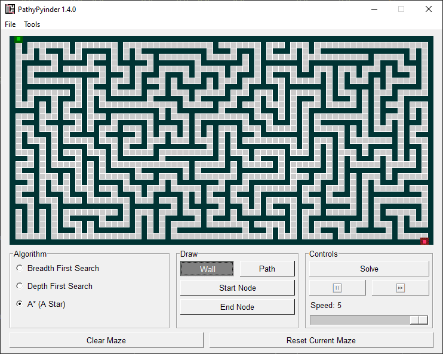

# PathPyinder
PathPyinder is an interactive pathfinding algorithm visualizer written in Python. Automatically generate mazes, draw your own custom mazes from scratch, or load pre-built mazes. Watch how three different pathfinding algorithms then solve the mazes you drew.

## Requirements
* **Windows**
* **Python** - Version 3.6 or higher

## Usage
Navigate to the root directory via terminal and launch PathPyinder with: `python pathpyinder.py`. If you have a Python 2.X and a 3.X installation on your machine, you may need to use the command `python3 pathpyinder.py`. The following GUI should open:

### **Drawing Mazes:**
PathPyinder is interactive, so you can draw your own mazes. There are four types of maze nodes that can be drawn: 
* **Wall**: A node that cannot be traversed.
* **Path**: A node that can be traversed.
* **Start**: The node from which the algorithm will start solving.
* **End**: The node that must be reached by the algorithm.

Select which node to draw by clicking the buttons in the *Draw* frame of the GUI, and clicking or dragging somewhere in the maze. You can clear out a maze using the **Clear Maze** button at the bottom left of the interface. You can also fill up the entire grid with wall nodes using *Tools > Fill Maze*.

### **Selecting an Algorithm:**
Use the radio buttons in the 'Algorithm' frame to select which algorithm will be used to solve the maze. Available algorithms include:
* [Breadth-First Search](https://en.wikipedia.org/wiki/Breadth-first_search#Applications)
* [Depth-First Search](https://en.wikipedia.org/wiki/Depth-first_search)
* [A* (A-Star)](https://en.wikipedia.org/wiki/A*_search_algorithm)

### **Solving Mazes:**
Click the **Solve** button in the *Controls* frame of the GUI to start solving the maze. Keep in mind, a start node and end node have to exist for PathPyinder to attempt solving. You can adjust the speed that the algorithm iterates by using the speed slider. You can also pause the algorithm entirely iterate through it one step at a time using the **Pause** and **Next** buttons under the **Solve** button.

### **Resetting and Clearing Mazes:**
* **Reset** button: stop solving, and reset the current maze to it's original, unsolved state.
* **Clear** button: stop solving, and erase the entire maze to an empty grid.

### **Saving and Loading Mazes:**
Save and load mazes via *File > Save Maze* and *File > Open Maze* in the menu bar. Mazes are saved as .txt files. There is a `/mazes` directory that includes some pre-built mazes.

### *Resizing the Maze:*
Mazes can be resized via *Settings > Maze Dimensions*

## Default Settings
You can change some options that PathPyinder initializes with via the *Settings > Defaults* menu option. Options that can be changed are:
* **Default Maze**: maze that's loaded on initialization.
* **Algorithm**: which algorithm is selected by default.
* **Speed**: how fast the algorithm moves through the maze.
* **Maze Dimensions**: the maze grid size.

## Acknowledgements
* [**PySimpleGUI**](https://github.com/PySimpleGUI) - Big thanks for making Python GUIs more palatable.